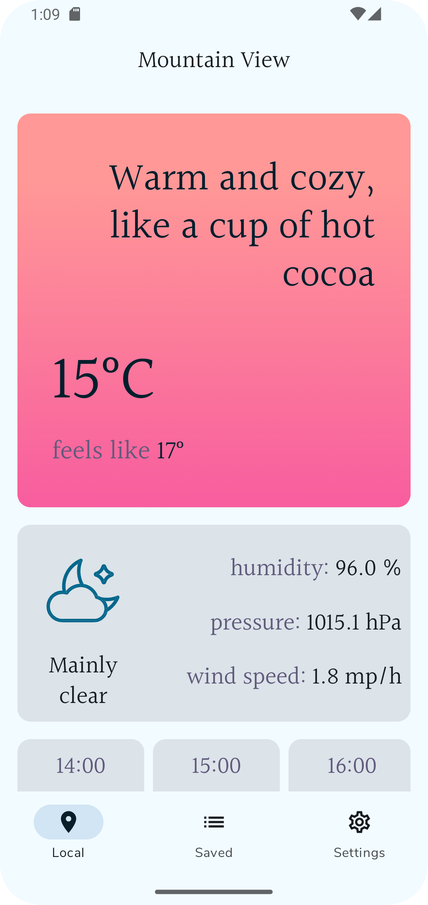
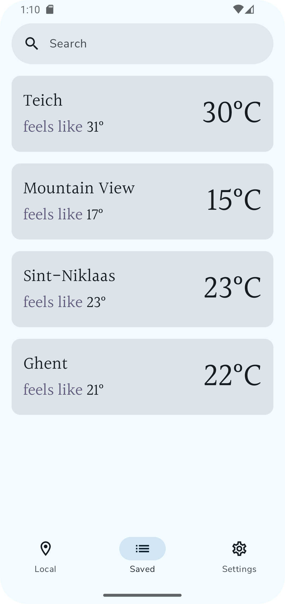
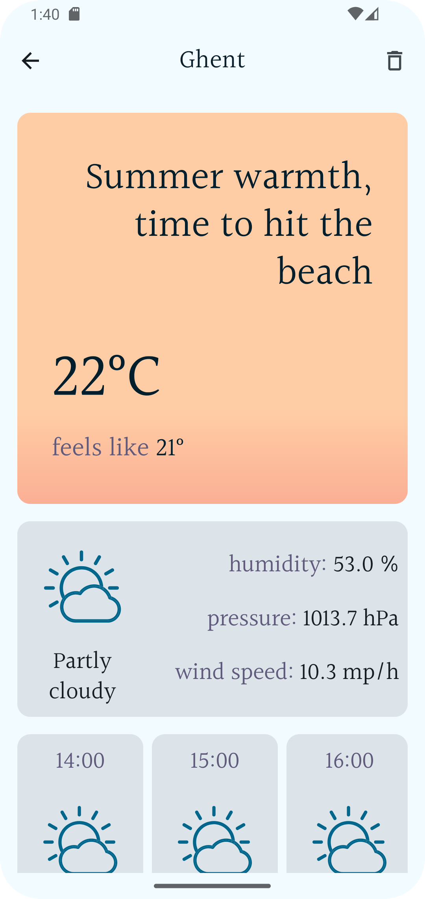
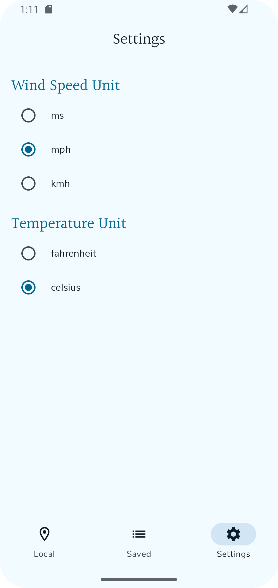

# The simple weather app

## This is a simple weather app that allows you to:

- Fetch weather data from your current location.
- Search for weather information in different cities.
- Save your favorite cities for quick access.

## 2. Features

- **Current Weather:** Display real-time weather information including temperature, humidity, wind speed, and atmospheric pressure for your current location.

- **Search by City:** Search for and view weather data for any city around the world.

- **Weather Forecast:** Provide a weather forecast till the end of the day with hourly temperature and weather conditions.

- **Favorite Cities:** Save multiple cities to your favorites list for quick access to their weather information.

- **Unit Conversion:** Switch between Celsius and Fahrenheit for temperature, and between kilometers and miles for wind speed.

- **Dark Mode:** Enjoy the app in dark mode for a comfortable viewing experience, especially at night.

- **Offline Mode:** Access recently viewed weather data even when offline, using cached data.

## 3. Screens

### Local Weather

The Local Weather screen provides real-time weather information for your current location. It displays temperature, humidity, wind speed, and atmospheric pressure.

### Saved Cities

The Saved Cities screen allows you to view and manage cities that you have saved as favorites. You can quickly access weather information for these cities.

### Detail Screen

The Detail Screen provides an in-depth view of the weather for a selected city. It includes detailed forecasts, weather conditions, and additional data.

### Settings

The Settings screen lets you customize your app experience. You can adjust units of measurement.

| **Local Weather**                                      | **Saved Cities**                                     | **Detail Screen**                               | **Settings**                                 |
| ------------------------------------------------------ | ---------------------------------------------------- | ----------------------------------------------- | -------------------------------------------- |
|  |  |  |  |

## 4. Installation

To set up the project locally, follow these simple steps:

1. **Clone the Repository:**

   First, clone the repository to your local machine using Git:

   ```bash
   git clone https://github.com/ArturSlimac/TheWeatherApp2
   ```

2. **Run the project in Android Studio**

## 5. Usage

### 1. Fetching Weather Data

- **Current Location Weather:**

  - When you first open the app, it will automatically fetch the weather for your current location (don't forget about location permission).
  - You can see information including temperature, humidity, wind speed, and atmospheric pressure.

- **Search for Cities:**
  - Use the search bar on **Saved Cities** screen to enter the name of any city around the world.
  - Tap on the search result to view the current weather and forecast for that city.

### 2. Viewing Weather Details

- **Local Weather Screen:**

  - Displays current weather conditions, hourly forecasts, and any severe weather alerts for your selected location.
  - Swipe up or down to view different times of the day.

- **Detail Screen:**
  - For more detailed information, tap on any weather condition to see an extended forecast and additional weather metrics.

### 3. Managing Favorite Cities

- **Save Favorite Cities:**

  - Tap on the plus icon next to a city name on **Detail** screen to save it to your list of favorite cities.
  - Access your saved cities from the **Saved Cities** tab to quickly view their weather.

- **Remove Favorite Cities:**
  - Go to the **Saved Cities** tab, select the city you want to remove, and tap on the trash icon to delete it from your favorites.

### 4. Adjusting Settings

- **Units and Preferences:**
  - Go to the **Settings** screen to adjust units of measurement (Celsius/Fahrenheit for temperature and kilometers/miles for wind speed).

## 6. Architecture

### Overview

This weather app utilizes the **Model-View-ViewModel (MVVM)** architecture pattern.
The documentation is available [here](https://arturslimac.github.io/TheWeatherApp2/).

### Project Structure

The project is organized into several key components, each with specific responsibilities:

```plaintext
theweatherapp
├── data
│   ├── device
│   │   ├── LocationRepositoryImpl.kt
│   │   └── SettingsRepositoryImpl.kt
│   ├── local
│   │   ├── CityDao.kt
│   │   ├── WeatherDao.kt
│   │   └── WeatherDatabase.kt
│   └── repository
│       ├── CityRepositoryImpl.kt
│       └── WeatherRepositoryImpl.kt
├── di
│   └── AppModules.kt
├── domain
│   ├── errors
│   │   ├── CustomError.kt
│   │   └── ErrorCode.kt
│   ├── formaters
│   │   └── Formaters.kt
│   ├── mappers
│   │   └── Mappers.kt
│   ├── model
│   │   ├── city
│   │   │   ├── CityItemEntity.kt
│   │   │   ├── CityItemModel.kt
│   │   │   └── CityModel.kt
│   │   ├── helpers
│   │   │   ├── CurrentTemperatureItem.kt
│   │   │   ├── CurrentWeatherItem.kt
│   │   │   ├── ShortWeatherOverview.kt
│   │   │   ├── TemperatureUiDetails.kt
│   │   │   ├── WeatherForecastItem.kt
│   │   │   └── WeatherType.kt
│   │   ├── weather
│   │   │   ├── CurrentEntity.kt
│   │   │   ├── CurrentModel.kt
│   │   │   ├── CurrentUnitsEntity.kt
│   │   │   ├── CurrentUnitsModel.kt
│   │   │   ├── HourlyEntity.kt
│   │   │   ├── HourlyModel.kt
│   │   │   ├── HourlyUnitsEntity.kt
│   │   │   ├── HourlyUnitsModel.kt
│   │   │   ├── WeatherEntity.kt
│   │   │   └── WeatherModel.kt
│   │   └── WeatherCityAllTogether.kt
│   └── repository
│       ├── CityRepository.kt
│       ├── LocationRepository.kt
│       ├── SettingsRepository.kt
│       └── WeatherRepository.kt
├── MainActivity.kt
├── network
│   └── service
│       ├── CityService.kt
│       └── WeatherService.kt
├── res
│   └── values-v23
│       └── font_certs.xml
├── screens
│   ├── DetailScreen.kt
│   ├── LocalWeatherScreen.kt
│   ├── SavedCitiesScreen.kt
│   └── UserSettingsScreen.kt
├── TheWeatherApp.kt
├── ui
│   ├── components
│   │   ├── AbsolutErrorBox.kt
│   │   ├── BottomNavigationBar.kt
│   │   ├── CircularIndicator.kt
│   │   ├── FoundListItem.kt
│   │   ├── top_bars
│   │   │   ├── TopBar.kt
│   │   │   ├── TopNavBar.kt
│   │   │   └── TopSearchBar.kt
│   │   └── weather_cards
│   │       ├── CurrentTemperatureCard.kt
│   │       ├── CurrentWeatherDetailsCard.kt
│   │       ├── ShortWeatherOverviewCard.kt
│   │       ├── WeatherForecastCard.kt
│   │       └── WeatherForecastCarousel.kt
│   ├── navigation
│   │   ├── AppNavHost.kt
│   │   └── NavigationDestinations.kt
│   └── theme
│       ├── Color.kt
│       ├── Theme.kt
│       └── Type.kt
├── utils
│   ├── Const.kt
│   ├── Converters.kt
│   └── Response.kt
└── viewmodel
    ├── LocalWeatherViewModel.kt
    ├── SavedCitiesViewModel.kt
    └── SettingsViewModel.kt


```

### Libraries

The app integrates various libraries to support functionality and ease of development:

- **AndroidX**: For modern Android components including `ViewModel`, and `Navigation`.
- **Retrofit**: Manages network requests and API interactions.
- **Room**: Provides local database operations and data persistence.
- **Dagger/Hilt**: Handles Dependency Injection, managing object creation and lifecycle.
- **Coroutines**: Facilitates asynchronous programming and background task management.
- **Material Design**: Implements Material Design components and theming.

### Design Patterns

- **MVVM (Model-View-ViewModel)**: Separates the UI from the data and business logic using ViewModels to handle data management.
- **Repository Pattern**: Encapsulates data operations and provides a clean API for data access.
- **Dependency Injection**: Utilizes Dagger/Hilt to manage dependencies and object creation.
